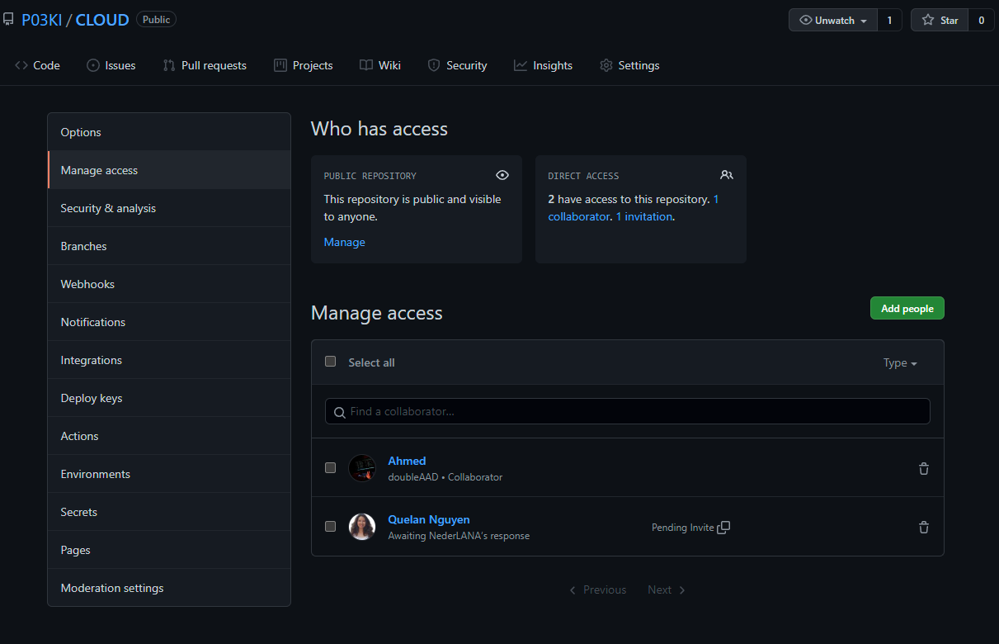

# [Git & GitHub]

Introductie Git

## Key-terms

Repository

- A repository contains all of your project's files and each file's revision history. You can discuss and manage your project's work within the repository.

Main / Master

- The name of the default branch that git creates for you when first creating a repo. In most cases, "master" means "the main branch". Most shops have everyone pushing to master, and master is considered the definitive view of the repo

Branch

- A branch is essentially is a unique set of code changes with a unique name. Each repository can have one or more branches. This is the official working version of your project, and the one you see when you visit the project repository at github.com/yourname/projectname.

Commit

- A commit, or "revision", is an individual change to a file (or set of files). When you make a commit to save your work, Git creates a unique ID (a.k.a. the "SHA" or "hash") that allows you to keep record of the specific changes committed along with who made them and when.

Push / Pull

- The git push command is used to upload local repository content to a remote repository. Pushing is how you transfer commits from your local repository to a remote repo. It's the counterpart to git fetch , but whereas fetching imports commits to local branches, pushing exports commits to remote branches.

Merge

- Merging is Git's way of putting a forked history back together again. The git merge command lets you take the independent lines of development created by git branch and integrate them into a single branch.

Fork

- A fork is a copy of a repository that you manage. Forks let you make changes to a project without affecting the original repository. You can fetch updates from or submit changes to the original repository with pull requests.

## Opdracht 1

Maak een GitHub account als je er nog geen hebt.

[Account](https://github.com/P03KI)

Maak een repository op je GitHub account voor je portfolio

[Repo](https://github.com/techgrounds/cloud-6-repo-P03KI)

Geef permissies aan je teamgenoten om de repository te gebruiken

Push je code naar je repository

In VSC (Visual Studio Code) -> Source Control -> Commit

Pull / Clone een repository van je peer.

## Opdracht 2

Maak een nieuwe repository aan voor je portfolio

- [Account](https://github.com/P03KI/CLOUD101)

Push je notities naar de repository

- Via VSC -> Commit

Deel deze repository met je Learning Coach

- Done

### Gebruikte bronnen

[GitHub](https://docs.github.com/en)

### Ervaren problemen

Kon niet gelijk syncen naar Github. Ging via push request waarbij ik verplichte comment moest invullen. Opmaak van file werkte niet. Kwam erachter dat de file geen .md was.

### Resultaat

Visual Studio Code aan GitHub gelinked via extension. Pulled repo, .md file aangepast, bewaard. Uitgevonden hoe ik files commit.

