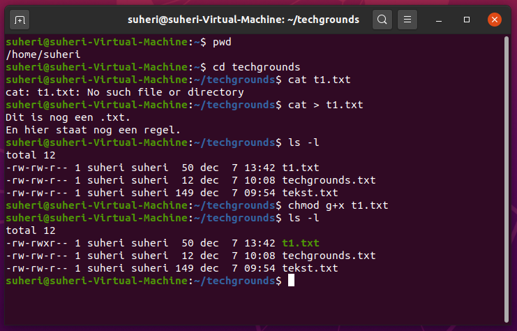

# File permissions

Omgaan met rechten van bestanden en folders.

## Key-terms

- Permissies

Ieder bestand op uw linux systeem, mappen inbegrepen, zijn eigendom van een specifieke gebruiker en groep. Daarom zijn permissies apart bepaald voor gebruikers, groepen en anderen.
User: De gebruikersnaam van de persoon die eigenaar is van het bestand. Standaard word degene die het bestand maakt automatisch de eigenaar.

Group: de gebruikersgroep die eigenaar is van het bestand. Alle gebruikers die tot die groep behoren hebben dezelfde toegangsrechten tot dit bestand.

Other: Een gebruiker die niet de eigenaar is van het bestand en niet behoord tot de groep waartoe het bestand behoort. In andere woorden, als je rechten toewijst aan de "other" categorie, wijs je standaard rechten toe aan iedereen.

Er zijn 3 types toegangsrechten in linux : lezen, schrijven en uitvoeren. Deze rechten worden apart toegewezen aan de eigenaar, groep of alle andere gebruikers.

Read permission : Bij een gewoon bestand betekent de "read permission" bit dat het bestand kan geopend en gelezen worden. Bij een map betekent deze permissie dat je de map kunt openen en een lijst zien van de inhoud.

Write permission : Bij een gewoon bestand betekent dit dat je de inhoud kunt wijzigen en nieuwe gegevens kunt toevoegen. In het geval van een map betekent de "write permission" dat je bestanden kunt toevoegen, verwijderen of hernoemen. Als een bestand de "write permission" bit heeft kun je de inhoud wijzigen maar het bestand hernoemen of verwijderen kan alleen als de permissies van de map waarin het bestand zich bevindt, dit toelaat.

Execute permission :  In het geval van een gewoon bestand betekent dit dat je het kunt uitvoeren als een programma of shell script. Bij een map laat de "execute permission" je toe bestanden in die map te benaderen en te  openen ( met het "cd" commando bv.)  maar je kunt geen lijst maken van de bestanden in die map, tenzij je de "read permission" hebt voor die map.

$ ls -l

## Opdracht

- Create a text file.

- Make a long listing to view the file’s permissions. Who is the file’s owner and group? What kind of permissions does the file have?

- Make the file executable by adding the execute permission (x).

- Remove the read and write permissions (rw) from the file for the group and everyone else, but not for the owner. Can you still read it?

- Change the owner of the file to a different user. If everything went well, you shouldn’t be able to read the file unless you assume root privileges with ‘sudo’.

- Change the group ownership of the file to a different group.

### Gebruikte bronnen

<https://cheatography.com/davechild/cheat-sheets/linux-command-line/>

<https://www.pluralsight.com/blog/it-ops/linux-file-permissions>

<https://docs.oracle.com/cd/E19683-01/816-4883/6mb2joat3/index.html>

### Ervaren problemen

Geen

### Resultaat

Zie screenshots bij Opdracht.
