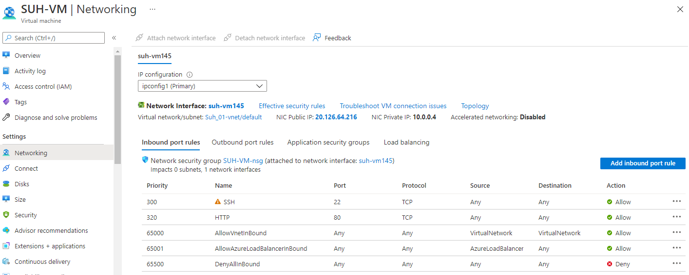

# **Azure Firewall**

Sinds alle bronnen in de cloud altijd online staan, is het belangrijk om deze te beveiligen tegen bedoeld en onbedoeld schadelijk verkeer. Azure Firewalls kunnen VNets beschermen tegen dit verkeer.

Je kan de Firewall in verschillende configuraties gebruiken in een subnet, of in een hub-and-spoke network. Een Firewall heeft altijd een publiek IP adres waar al het inkomend verkeer naartoe gestuurd dient te worden. En een privé IP adres waar al het uitgaande verkeer naartoe moet.

Zoals je eerder geleerd hebt zijn er twee soorten firewalls: stateless, en stateful. Azure Firewall is een stateful firewall. 

## **Key-terms**

- Het verschil tussen Basic en Premium Firewall

    -

- Het verschil tussen een Firewall en een Firewallbeleid (Firewall Policy)
    
    - 

- Dat Azure Firewall veel meer is dan alleen een firewall

    -

## **Opdracht**

- Zet een webserver aan. Zorg dat de poorten voor zowel SSH als HTTP geopend zijn.
- Maak een Azure Firewall in VNET. Zorg ervoor dat je webserver nog steeds bereikbaar is via HTTP, maar dat SSH geblokkeerd wordt.

### **Gebruikte bronnen**

*<https://docs.microsoft.com/nl-nl/azure/firewall/tutorial-firewall-deploy-portal>*

*<https://docs.microsoft.com/nl-nl/azure/virtual-network/virtual-networks-overview>*

### **Ervaren problemen**

Geen

### **Resultaat**

- Zet een webserver aan. Zorg dat de poorten voor zowel SSH als HTTP geopend zijn.

Maak een Azure Firewall in VNET. Zorg ervoor dat je webserver nog steeds bereikbaar is via HTTP, maar dat SSH geblokkeerd wordt.
