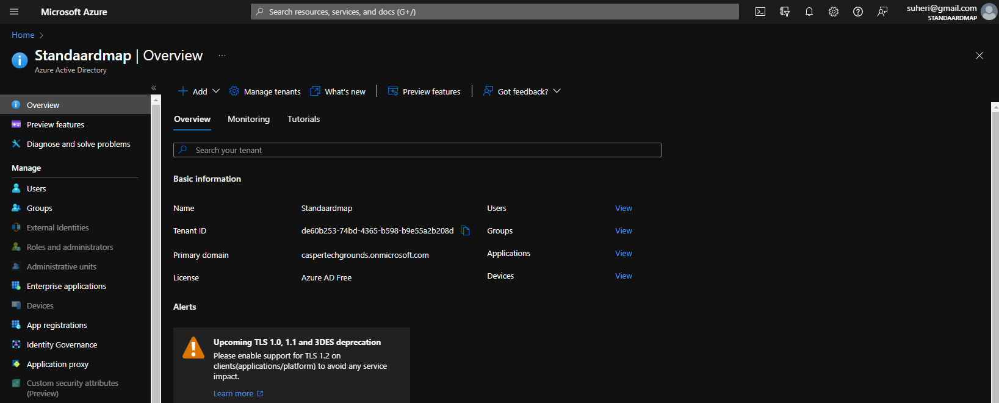
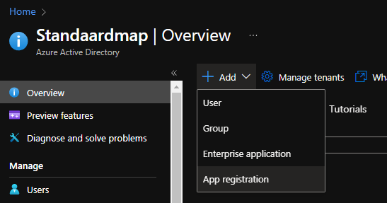

# **Azure Active Directory**

Azure Active Directory (Azure AD) is de identiteits- en toegangsbeheerservice van Microsoft in de cloud, waarmee genruikers zich kunnen aanmelden en toegang kunnen krijgen tot  resources in:

- **Externe resources**, zoals Microsoft 365, de Azure-portal en duizenden andere SaaS-toepassingen.

- **Interne resources**, zoals apps op het bedrijfsnetwerk en intranet, samen met zelf ontwikkelde cloud-apps.

Azure AD is bedoeld voor:

- **IT-beheerders**  toegang tot apps en app-resources te beheren, meervoudige verificatie. automatische inrichting AD en cloud. 30 dagen trial

- **App-ontwikkelaars** 30 dagen trial, API voor apps, SSO aanmelding

- **Abonnees  van Microsoft 365, Office 365, Azure of Dynamics CRM Online** Automatisch

**Licenties**

- **Azure Active Directory Free**. Biedt gebruikers- en groepsbeheer, on-premises adreslijstsynchronisatie, eenvoudige rapporten, selfservice voor wachtwoord wijzigen voor cloudgebruikers en eenmalige aanmelding voor Azure, Microsoft 365 en SaaS-apps.

- **Azure Active Directory Premium P1** Hybride gebruikers toegang verlenen tot zowel on-premises als cloudresources. Geavanceerd beheer, zoals dynamische groepen, selfservice voor groepsbeheer, Microsoft Identity Manager (een on-premises pakket voor identiteits- en toegangsbeheer) en cloudfuncties voor terugschrijven, die selfservice voor wachtwoordherstel voor on-premises gebruikers mogelijk maken.

- **Azure Active Directory Premium P2**  [Azure Active Directory Identity Protection](https://docs.microsoft.com/nl-nl/azure/active-directory/identity-protection/overview-identity-protection) voor op risico’s gebaseerde voorwaardelijke toegang tot uw apps en kritieke bedrijfsgegevens, en [Privileged Identity Management](https://docs.microsoft.com/nl-nl/azure/active-directory/privileged-identity-management/pim-getting-started) voor het detecteren, beperken en bewaken van beheerders en hun toegang tot resources, en om just-in-time-toegang te bieden wanneer het nodig is.
- **Functielicenties met Betalen per gebruik**  Azure Active Directory Business-to-Customer (B2C). Met [B2C](https://docs.microsoft.com/nl-nl/azure/active-directory-b2c/) kunt u identiteits- en toegangsbeheeroplossingen bieden voor klantgerichte apps.

**Functies**

|  Categorie  |	Beschrijving  |
| --- | --- |
|Toepassingsbeheer	|Beheer uw apps in de cloud of on-premises met de toepassingsproxy, eenmalige aanmelding, de portal My Apps (ook wel Toegangsvenster genoemd) en SaaS-apps (Software als een dienst).
|Verificatie	|In Azure Active Directory kunt u selfservice voor wachtwoordherstel, Multi-Factor Authentication, een aangepaste lijst met verboden wachtwoorden en slimme vergrendeling beheren. 
|Azure Active Directory voor ontwikkelaars|	Bouw apps waarmee alle Microsoft-identiteiten worden aangemeld en haal tokens op voor het aanroepen van Microsoft Graph, andere Microsoft-API's of aangepaste API's. 
|Business-to-business (B2B)	| U beheert gastgebruikers en externe partners, terwijl u de controle houdt over uw eigen zakelijke gegevens. 
|Business-to-customer (B2C)|	U kunt aanpassen en controleren hoe uw gebruikers zich registreren, zich aanmelden en hun profielen beheren als ze uw apps gebruiken. 
|Voorwaardelijke toegang|	Beheer de toegang tot uw cloud-apps. 
|Apparaatbeheer	|Beheer hoe uw cloud- of on-premises apparaten toegang hebben tot uw zakelijke gegevens. 
|Domeinservices	|Voeg virtuele Azure-machines toe aan een domein zonder gebruik te maken van domeincontrollers. 
|Zakelijke gebruikers	|Beheer het toewijzen van licenties, de toegang tot apps en het instellen van gedelegeerden met behulp van groepen en beheerdersrollen. 
|Hybride identiteit	|Gebruik Azure Active Directory Connect en Connect Health om één gebruikersidentiteit te bieden voor verificatie en autorisatie van alle resources, ongeacht de locatie (cloud of on-premises). 
Identiteitsbeheer	|Beheer de identiteit van uw organisatie via besturingselementen voor werknemers, zakelijke partners, leveranciers, service en app-toegang. U kunt ook toegangsbeoordelingen uitvoeren.
Identiteitsbeveiliging|	Detecteer potentiële beveiligingsproblemen die de identiteiten van uw organisatie treffen; configureer beleid om te reageren op verdachte activiteiten en neem vervolgens gepaste actie om de problemen op te lossen. 
Beheerde identiteiten voor Azure-resources	|Voorzie uw Azure-services van een automatisch beheerde identiteit in Azure AD die elke door Azure Ad ondersteunde verificatieservice kan verifiëren, inclusief Key Vault. 
Privileged Identity Management (PIM)	|Beheer, controleer en bewaak de toegang binnen uw organisatie. Deze functie omvat toegang tot resources in Azure AD en Azure, en andere Microsoft-onlineservices zoals Microsoft 365 en Intune. 
Rapporten en controle	|Krijg inzicht in de beveiliging en gebruikspatronen in uw omgeving. 

 

## **Key-terms**

**Identiteit**
- Een ding dat kan worden geverifieerd. Een identiteit kan een gebruiker met een gebruikersnaam en wachtwoord zijn. Identiteiten omvatten ook toepassingen of andere servers die mogelijk moeten worden geverifieerd via geheime sleutels of certificaten.

**Account**
- Een identiteit waaraan gegevens zijn gekoppeld. U kunt geen account hebben zonder een identiteit.

**Azure AD-account**	

- Een identiteit die wordt gemaakt via Azure AD of een andere cloudservice van Microsoft, bijvoorbeeld Microsoft 365. Identiteiten worden opgeslagen in Azure AD en zijn toegankelijk voor de cloudservice-abonnementen van de organisatie. Dit account wordt ook wel een werk- of schoolaccount genoemd.

**Accountbeheerder**
- Deze rol van klassieke abonnementsbeheerder is conceptueel gezien de eigenaar facturering van een abonnement. Met deze rol kunt u alle abonnementen in een account beheren. Zie Klassieke abonnementsbeheerdersrollen, Azure-rollen en Azure AD-beheerdersrollen voor meer informatie.

**Servicebeheerder**	
- Met deze klassieke abonnementsbeheerdersrol kunt u alle Azure-resources beheren, inclusief de toegang. Deze rol heeft dezelfde toegang als een gebruiker met de rol van eigenaar op abonnementsniveau. Zie Klassieke abonnementsbeheerdersrollen, Azure-rollen en Azure AD-beheerdersrollen voor meer informatie.

**Eigenaar**	
- Met deze rol kunt u alle Azure-resources beheren, inclusief de toegang. Deze rol bouwt voort op een nieuwer autorisatiesysteem, het zogeheten op rollen gebaseerd toegangsbeheer van Azure (Azure RBAC), waarmee uiterst gedetailleerd toegangsbeheer tot Azure-resources kan worden verkregen. Zie Klassieke abonnementsbeheerdersrollen, Azure-rollen en Azure AD-beheerdersrollen voor meer informatie.

**Globale Azure AD-beheerder**	
- Deze beheerdersrol wordt automatisch toegewezen aan personen die de Azure AD-tenant hebben gemaakt. Globale beheerders kunnen alle beheerfuncties voor Azure AD uitvoeren, en tevens voor andere services die met Azure AD federeren, zoals Exchange Online, SharePoint Online en Skype voor Bedrijven Online. Er kunnen meerdere globale beheerders zijn, maar alleen globale beheerders kunnen beheerdersrollen aan gebruikers toewijzen (inclusief het toewijzen van andere globale beheerders). Zie Machtigingen van de rol beheerder in Azure Active Directory voor meer informatie over de verschillende beheerdersrollen.

**Azure-abonnement**	
- Dit wordt gebruikt voor de betaling van Azure-cloudservices. U kunt zo veel abonnementen hebben als u wilt. Ze zijn gekoppeld aan uw creditcard.

**Azure-tenant**	
- De tenant is een speciaal en vertrouwd exemplaar van Azure AD dat automatisch wordt gemaakt wanneer uw organisatie zich registreert voor een abonnement op een cloudservice van Microsoft, bijvoorbeeld Microsoft Azure, Microsoft Intune of Microsoft 365. Een Azure-tenant vertegenwoordigt één organisatie.
Eén tenant	Azure-tenants die toegang hebben tot andere services in een toegewezen omgeving, worden als één tenant beschouwd.

**Multitenant**
- Azure-tenants die toegang hebben tot andere services in een gedeelde omgeving in meerdere organisaties, worden als meerdere tenants beschouwd.

**Azure AD-directory**	
- Elke Azure-tenant beschikt over een toegewezen en vertrouwde Azure AD-directory. Deze Azure AD-directory omvat de gebruikers, groepen en apps van de gebruiker en wordt gebruikt om identiteits- en toegangsbeheerfuncties voor resources van tenants uit te voeren.

**Aangepast domein**	
- Elke nieuwe Azure AD-directory heeft in eerste instantie een domeinnaam van de vorm domeinnaam.onmicrosoft.com. Naast deze initiële naam kunt u ook de domeinnamen van uw organisatie aan de lijst toevoegen. Deze omvatten de namen die u voor uw bedrijf gebruikt en waarmee uw gebruikers toegang tot de resources van de organisatie krijgen. Als u aangepaste domeinnamen toevoegt, kunt u gebruikersnamen maken waarmee uw gebruikers vertrouwd zijn, zoals alain@contoso.com.

**Microsoft-account (ook MSA genoemd)**
- Persoonlijke accounts die toegang verlenen tot uw consumentgerichte producten en cloudservices van Microsoft, bijvoorbeeld Outlook, OneDrive, Xbox LIVE en Microsoft 365. Uw Microsoft-account wordt gemaakt en opgeslagen in het accountsysteem voor consumentidentiteiten van Microsoft, dat wordt beheerd door Microsoft.

## **Opdracht**

- Bestudeer Azure Directory

### **Gebruikte bronnen**

*<https://docs.microsoft.com/en-us/azure/active-directory/fundamentals/active-directory-whatis>*

### **Ervaren problemen**

*Geen*

### **Resultaat**

*Waar is Azure Active Directory voor?*

- de identiteits- en toegangsbeheerservice van Microsoft in de cloud

*Hoe vervangt Azure Active Directory in een klassieke setting?*

- Active Directory in de cloud. Vertrouwde service met nieuwe services.

*Hoe kan ik Azure Active Directory combineren met andere diensten?*

- Goede integratie met SaaS toepassingen en eigen apps.

*Wat is het verschil tussen Azure Active Directory en andere gelijksoortige diensten?*

- [Verschil tussen Active Directory en Azure Active Directory](https://docs.microsoft.com/nl-nl/azure/active-directory/fundamentals/active-directory-compare-azure-ad-to-ad) Azure AD voegt IDaaS (*Identity as a Service*) toe.

*Waar kan ik deze dienst vinden in de console?*

*Hoe zet ik deze dienst aan?*

-  Staat standaard al aan. ( Heb zelf MS365 abo)

*Hoe kan ik deze dienst koppelen aan andere resources?*

