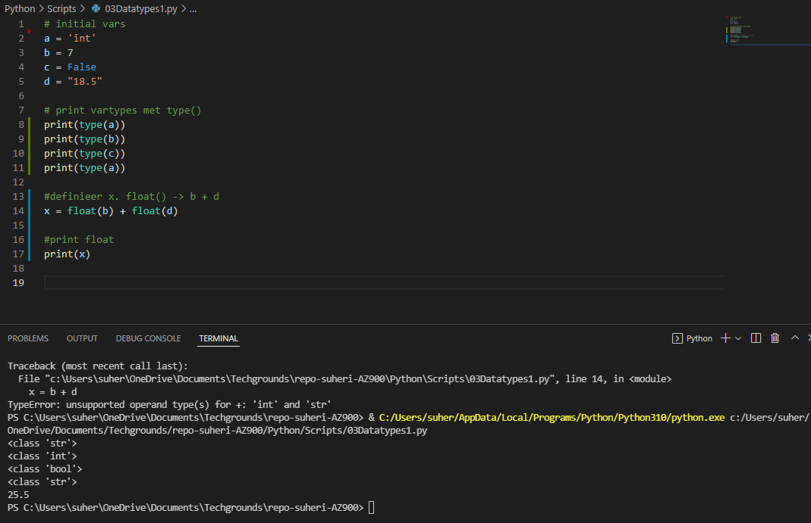

# **Data types and comments**

## **Opdracht 1**

    Create a new script.
    Copy the code below into your script.
    a = 'int'
    b = 7
    c = False
    d = "18.5"
    Determine the data types of all four variables (a, b, c, d) using a built in function.
    Make a new variable x and give it the value b + d. Print the value of x. 
    This will raise an error. Fix it so that print(x) prints a float.
    Write a comment above every line of code that tells the reader what is going on in your script.

[Code](../06_Python/Scripts/03Datatypes1.py)

## **Opdracht 2**

    Create a new script.
    Use the input() function to get input from the user. Store that input in a variable.
    Find out what data type the output of input() is. 
    See if it is different for different kinds of input (numbers, words, etc.).

    --> input() slaat alles op in een string 

[Code](../06_Python/Scripts/03Datatypes2.py)

### **Gebruikte bronnen**

*<https://www.w3schools.com/python/python_variables.asp>*

*<https://www.w3schools.com/python/ref_func_input.asp>*