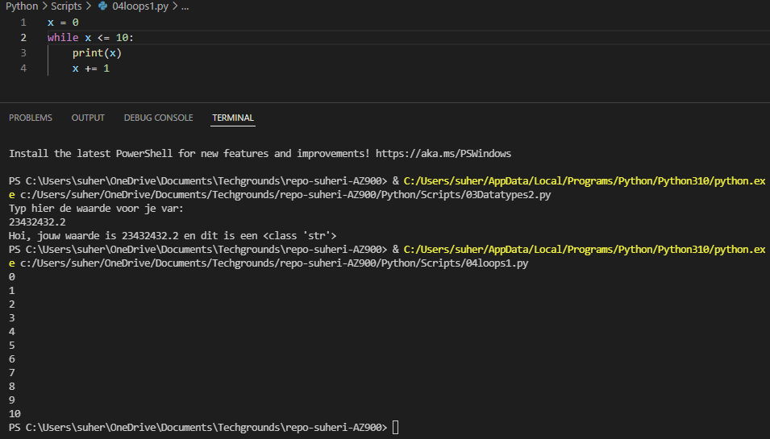
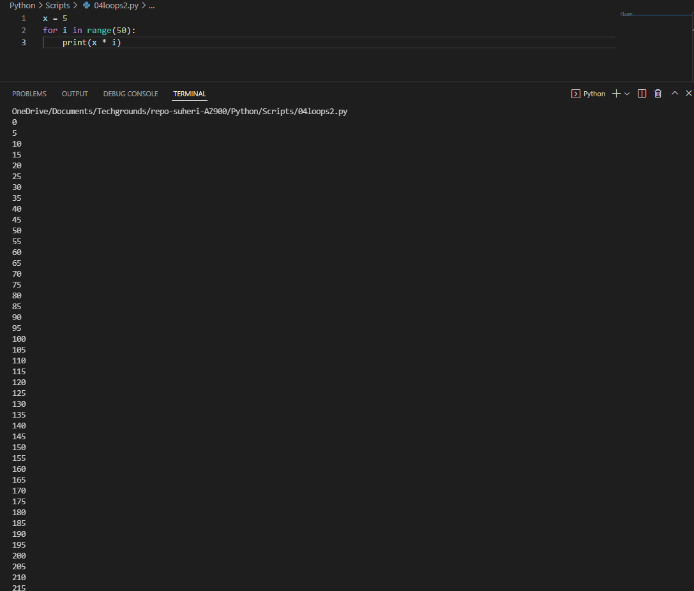
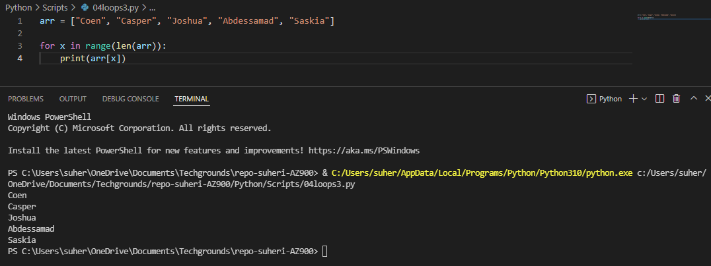

# **Loops**

## **Opdracht 1**

    Create a new script.
    Create a variable x and give it the value 0.
    Use a while loop to print the value of x in every iteration of the loop. After printing, the value of x should increase by 1. The loop should run as long as x is smaller than or equal to 10.

[Code](../Python/Scripts/04loops1.py)

## **Opdracht 2**

    Create a new script.
    Copy the code below into your script.
    for i in range(10):
        # do something here
    Print the value of i in the for loop. You did not manually assign a value to i. Figure out how its value is determined.

    Add a variable x with value 5 at the top of your script.
    Using the for loop, print the value of x multiplied by the value of i, for up to 50 iterations.

[Code](../Python/Scripts/04loops2.py)

## **Opdracht 3**

    Create a new script.
    Copy the array below into your script.
    arr = ["Coen", "Casper", "Joshua", "Abdessamad", "Saskia"]
    Use a for loop to loop over the array. Print every name individually.

[Code](../Python/Scripts/04loops3.py)

### **Gebruikte bronnen**

*<https://www.w3schools.com/python/python_for_loops.asp>*
